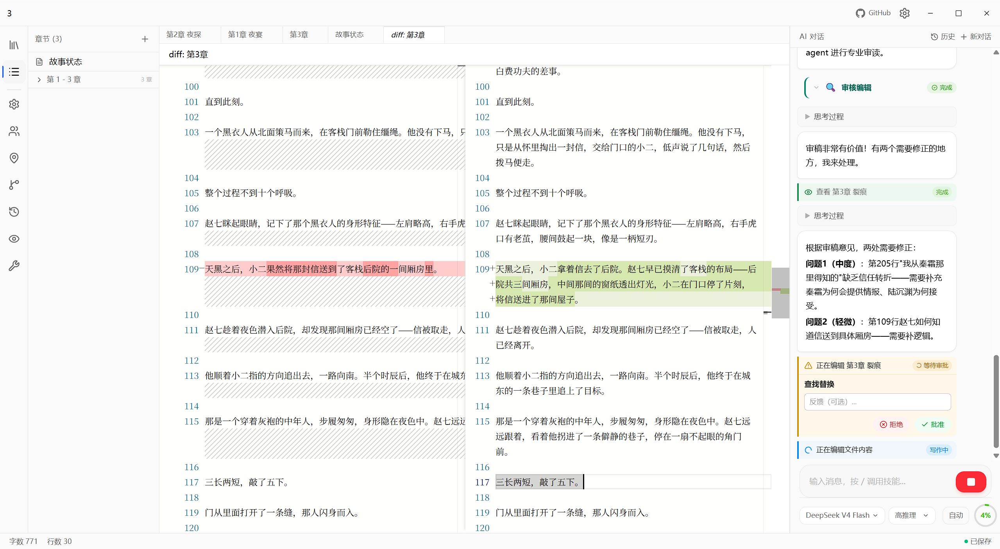
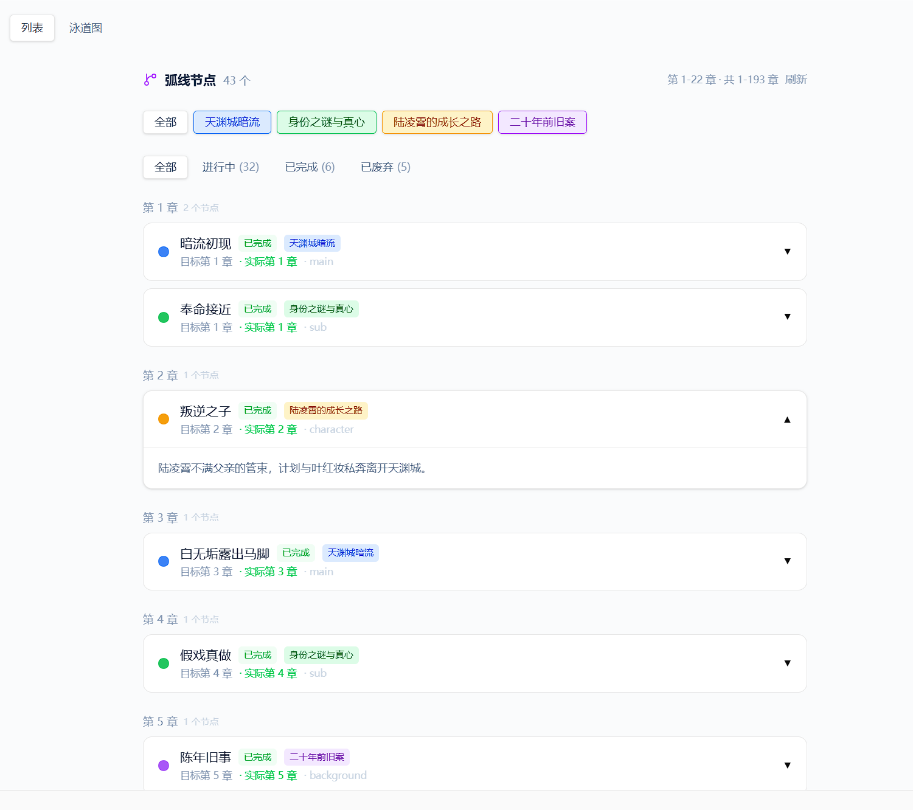
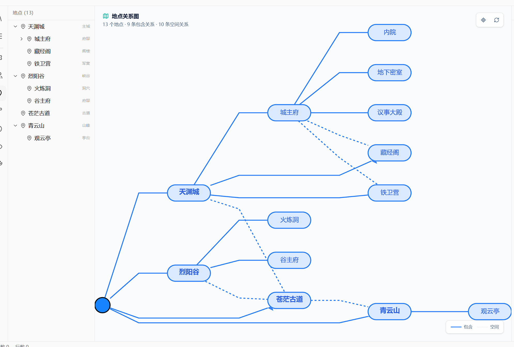
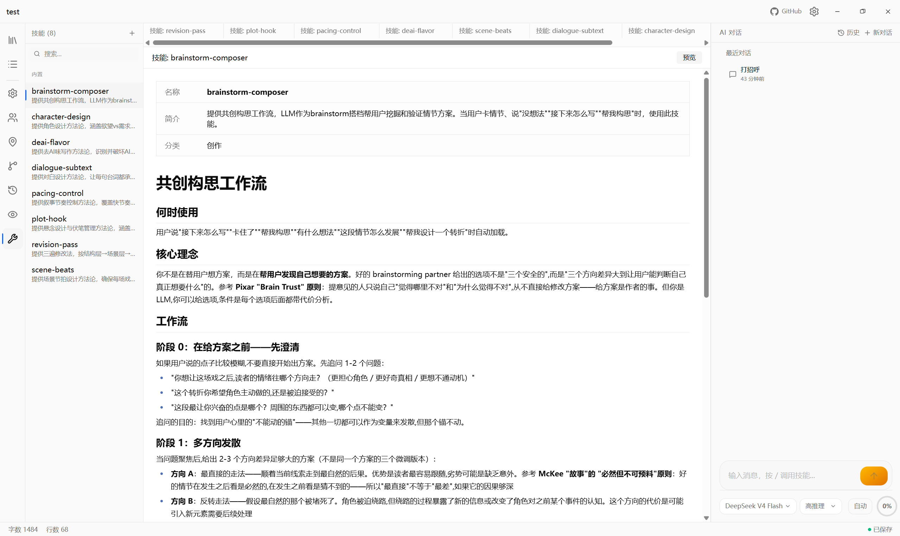

**中文** | [English](README_EN.md)

<div align="center">


</div>

<p align="center">
  
  
</p>

<h1 align="center">Novelist</h1>
<p align="center">
  本地优先的 AI 长篇写作工作台：结构化记忆、Agent 工具、Skill 方法论、参考锚定、草稿审计和版本历史。
</p>

<p align="center">
  
  
  
  
  <br />
  
  
  
  
</p>

---

Novelist 面向长篇小说创作。它不是简单的聊天壳，也不是只把一组 Prompt 或 Skill 丢给模型；它把小说项目拆成可查询、可维护、可审计的结构化状态，让 AI 可以辅助创作，但关键写入仍由作者确认。

## 核心能力

| 能力 | 说明 |
|---|---|
| 结构化创作状态 | 管理角色、关系、伏笔、弧线、地点、读者认知、偏好和章节计划 |
| Agent 工具调用 | AI 可以读取章节、搜索前文、更新项目状态、维护偏好和生成候选内容 |
| Skill 写作方法论 | 以 Markdown Skill 提供场景节拍、对白潜台词、节奏、悬念、修订、去 AI 味等流程 |
| 本地语义搜索 | RAG 状态保存在 SQLite/sqlite-vec；Embeddings 支持在线 OpenAI-compatible API 或本地 ONNX |
| Diff 审批与历史 | 正文修改走显式保存和审批边界，项目变更保留 Git 历史 |
| 参考锚定 | 将参考资料、蓝图、材料绑定、候选草稿和审计结果转成可检查记录 |

## 参考锚定

参考锚定层解决的是“AI 能不能写、该根据什么写、写完能不能用”的问题。Skill 负责方法和风格；参考锚定负责来源、事实边界、POV、蓝图质量、材料绑定和草稿审计。

默认流程：

```text
作者确认来源策略、章节目标、已知事实、禁止事实
  -> 启动 orchestration run
  -> 生成章节蓝图
  -> 执行确定性蓝图审查
  -> 作者批准蓝图，或批准 AI 提议的字段级修订
  -> 检索并绑定参考材料
  -> 生成 beat 级候选草稿
  -> 执行草稿审计
  -> 停在最终正文插入确认点
```

系统会在这些位置停下并要求作者确认：

- 来源、授权、已知事实或禁止事实不明确；
- 蓝图过期、缺材料、弱检索或材料哈希不匹配；
- 蓝图审查失败，需要修订；
- 参考改写级别、POV、事实边界或审计结果存在高风险；
- 候选草稿准备插入正文。

参考锚定流程不会自动调用 `SaveContent` 写入章节正文。AI 可以提出候选和修订，最终正文插入仍走作者确认后的编辑/保存路径。

## Skill 自定义

Skill 是写作方法论模块。每个 Skill 是带 YAML frontmatter 的 Markdown 文件，支持三层覆盖和三种触发模式：

| 机制 | 说明 |
|---|---|
| 覆盖顺序 | 小说级 `skills/<name>.md` > 用户级 `~/.novelist/skills/<name>.md` > 内置只读 `/builtin/skills/<name>.md` |
| 触发模式 | `auto` 可由 AI 自主调用并支持 `/` 触发；`manual` 只支持用户 `/` 触发；`always` 会在会话开头注入 |
| 状态文件 | `novelist.md` 保存故事状态，供 Agent 恢复上下文和维护长期创作状态 |

最小 Skill 文件：

```markdown
---
name: 节奏控制
description: 控制场景推进、停顿和悬念释放
category: 写作方法
mode: auto
---

# 使用方法

根据当前章节目标调整叙事节奏。
```

## 当前状态

| 范围 | 状态 |
|---|---|
| 桌面主线 | 已迁移到 `.NET 10 + Photino.NET + React/Vite` |
| 参考锚定 | Phase 0-13 已按当前实现边界完成；Phase 14 已打开，目标是高级素材理解、风格画像、风格锚定检索、仿写候选和来源泄漏/风格质量审计 |
| 前端构建 | Vite 8/Rolldown 已拆分主入口、工作区、Monaco、Markdown、Mermaid 和图谱依赖 |
| 旧实现 | Go/Wails 与旧 Python 实现已退役；新功能不要写入 `app/`、`internal/`、`python-master/` 或 `frontend/src/lib/wailsjs/` |

## 最新更新

### 2026-07-07

- 参考风格画像构建现在会记录可恢复的构建状态，可查看进度、取消运行中的构建，并在失败或取消后继续检查结果；状态记录不保存来源正文、候选正文、Prompt 或文件路径。
- Agent 参考锚定工具现在不能批准带 `style_contract` 的蓝图；AI 可以提出和评审风格合约修订，但风格合约审批必须由用户确认。
- 参考锚定的 style/source-leak 审计发现现在可通过桌面桥接和 Agent 单独只读查看，并且不会返回候选正文、来源正文、Prompt 或写章节能力。
- 参考锚定草稿审计现在会拦截夹带长段来源原句的候选，并且报告只显示复用长度和比例，不回显来源句子。
- 参考风格锚定新增黄金评估套件，覆盖八类典型风格并生成不含来源正文或候选正文的评估报告。
- 参考锚定草稿审计现在会在候选段落区显示可读报告，包括候选 ID、问题分类、严重级别和处理动作。
- 生成草稿和手动审计都会持久化审计报告与候选 ID；报告不额外保存候选正文、来源正文或 Prompt。
- 已持久化的草稿审计报告可通过桌面桥接和 Agent 只读查看，支持按蓝图、候选 ID 和条数限制检索，但不提供正文写入或审批能力。

完整变更见 [Release Notes](docs/releases/release-notes.md)。

## 截图

<p align="center">
  
</p>
<p align="center">
  
  
</p>
<p align="center">
  
  
</p>

## 项目结构

```text
src/
  Novelist.App             Photino 桌面宿主和本地前端资源解析
  Novelist.Contracts       桥接 DTO 和跨层契约
  Novelist.Core            应用接口、桥接分发和核心边界
  Novelist.Infrastructure  文件系统、SQLite、RAG、参考锚定实现
  Novelist.Agent           Microsoft Agent Framework 工具适配

frontend/
  src/lib/novelist         自有 Photino bridge adapter
  src/components           React UI 组件
  scripts                  Playwright mock-bridge 工作流

tests/
  Novelist.Tests
  Novelist.IntegrationTests
```

## 安装

从 [Releases](https://github.com/devhxj/novelist/releases) 下载对应平台安装包：

- **Windows**：运行安装程序
- **macOS**：打开 DMG，拖入 Applications
- **Linux**：运行 AppImage

需要配置 LLM API Key。内置 DeepSeek、GLM、MiMo 模板，并兼容 OpenAI 格式接口。安装包自带桌面宿主、前端资源和 Git 运行时，不需要 Python、Node.js 或外部数据库。

语义检索可使用在线 Embeddings API，也可切换到内置 ONNX。ONNX 模式固定使用随包的 `bge-small-zh-v1.5` int8 模型，不会静默回退到线上 API。

Windows SmartScreen 可能提示未签名程序，可通过“更多信息”继续运行。

## 从源码构建

依赖：

- .NET 10 SDK
- Node.js/npm
- GNU make 与 bash
- Linux 桌面运行需要 GTK/WebKit 依赖

```bash
sudo apt install libgtk-3-0 libwebkit2gtk-4.1-0 curl file unzip
git clone https://github.com/devhxj/novelist
cd novelist
dotnet restore Novelist.slnx
npm --prefix frontend ci
make deps
make build
```

启动桌面开发模式：

```bash
npm --prefix frontend run build
make dev
```

只调试前端：

```bash
make frontend-dev
```

`make frontend-dev` 只启动 Vite，桌面桥接 API 不可用。如需桥接能力，让 Photino 宿主用 `--start-url=http://localhost:5173/` 加载 Vite 页面。

## 常用命令

| 命令 | 用途 |
|---|---|
| `make deps` | 下载或复用打包所需 Git 运行时 |
| `make dev` | 启动 Photino/.NET 桌面应用 |
| `make build` | 构建前端、准备运行时依赖并发布桌面输出 |
| `make publish RID=win-x64` | 发布指定 RID 的自包含产物 |
| `make package-windows` | 生成 Windows 安装包 |
| `make package-linux` | 生成 Linux AppImage |
| `make package-macos` | 生成 macOS DMG |
| `npm --prefix frontend run build` | TypeScript 构建和 Vite 生产构建 |
| `npm --prefix frontend run lint` | 前端 ESLint |
| `npm --prefix frontend run verify` | 前端 build、lint、参考锚定流程和基础 app-wide 烟测；发布级回归还需要 Phase 13 full/stress/usability，Phase 14 将新增 reference-style 专项命令 |
| `dotnet test Novelist.slnx --no-restore -v minimal` | .NET 测试套件 |

## 质量边界

开发或审查相关代码时，请保留这些边界：

- 正文写入必须经过作者确认，不允许参考锚定编排直接保存正文；
- 文件访问保持 SafePath 和沙箱检查；
- Web/外部资源工具保持 SSRF 防护；
- 用户数据迁移必须 copy-first，源数据保持不变并写入 manifest；
- API Key、本地模型路径和用户数据不进入 git；
- 运行时 Git 与本地 ONNX 模型放在 `build/runtime/` 或 app data/config 路径；ONNX Runtime 与 sqlite-vec 通过 NuGet 发布资产进入产物，额外覆盖库也不要放源码目录。

## 文档入口

- [Reference Anchor Technical Baseline](docs/reference-anchor-layer-plan.md)
- [Reference Anchor Implementation Plan](docs/reference-anchor-implementation-plan.md)
- [Photino Bridge Contract](docs/novelist-photino-bridge-contract.md)
- [Release Notes](docs/releases/release-notes.md)

## 许可与来源

Novelist 以 MIT License 发布，详见 [LICENSE](LICENSE)。项目最初 fork 自 MIT 版本 GoInk，当前主体已重做为 `.NET 10 + Photino.NET + React/Vite` 的 Novelist。来源与兼容边界见 [NOTICE](NOTICE)。

本仓库不合并上游改为 AGPL 后的新代码；若继续使用或分发本仓库，请保留 MIT 版权和许可声明。
