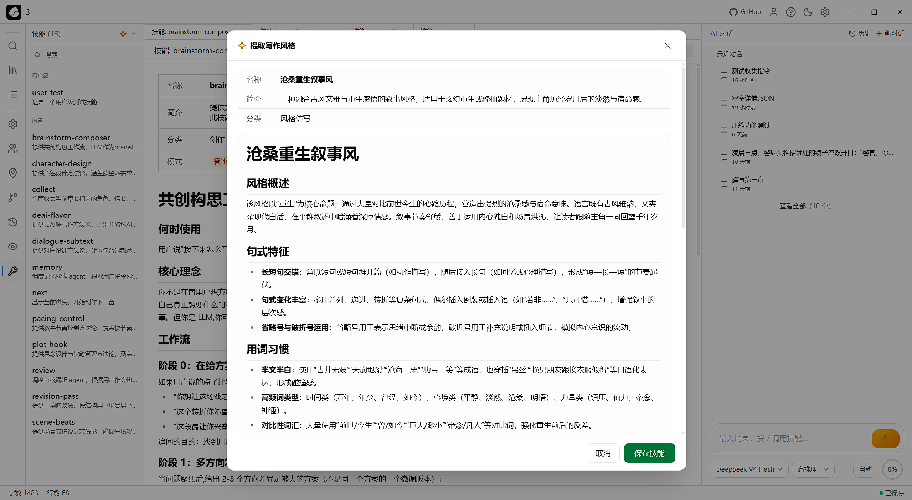

<p align="center">
  
  
</p>

<h1 align="center">桌面 AI 写作系统<br><sub>Agent 实时决策 × 结构化记忆 × 写完自检状态</sub></h1>

<p align="center">
  
  
  
  
  <br />
  
  
  
  
</p>

---

<p align="center"><strong>用过通用 AI 写长篇小说的人都知道——写到第五章它就忘了主角叫什么。到第三十章还要手动翻前文找那句伏笔。写完一章还得自己提醒它"更新角色状态""检查弧线进度"。Novelist 不会。它是一个有结构化记忆的桌面 AI 写作系统——角色档案、伏笔状态、弧线进度、地点关系、读者认知，系统记着，Agent 自己查、自己改、自己维护。</strong></p>

## 最新更新

### 2026-07-05

- 创建参考锚点时可通过系统文件选择器选择本地参考源文件，仍保留手动输入路径能力。
- 选择 `.txt`、`.md` 或 `.markdown` 文件后，参考源格式会按扩展名自动匹配，减少导入时的手动切换。
- 配置 Embeddings 后，参考锚点导入和重建会为参考材料建立专用向量索引；sqlite-vec 缺失时会显示为可恢复的 embedding 失败状态，已导入材料仍可继续检索。
- 参考复用审计现在会列出 L2 轻度改写中的非槽位改动，方便判断候选是否仍在可接受范围内。
- 参考锚定流程现在会持久化接受、拒绝和人工编辑反馈记录，为后续材料排序与坏候选回归提供依据。
- 蓝图材料绑定会给已被接受过的参考材料加分，并在评分组成中显示反馈 boost。
- 蓝图材料匹配现在可以先返回按 beat 排序的候选而不自动选中；工作区的绑定按钮会显式选中每个 beat 的最高分候选后再进入候选草稿生成。
- 候选草稿生成现在允许已批准 `no_reuse_reason` 的过渡 beat 跳过材料链接，普通 beat 仍必须有当前材料链接。
- 候选草稿生成会验证每个候选都能追溯到当前选中的材料链接；未批准的 no-reuse 或材料不匹配会被拒绝。
- 候选草稿审计现在会检查 beat 的段落意图、执行模式和候选拒绝规则，纯走位候选不能冒充需要停留/迟疑的段落。
- 候选草稿审计会把 subtext、感官锚点和 source-backed detail 的必需目标纳入检查，缺少指定暗示或细节会要求修正。
- 候选草稿审计现在会拦截 close/limited 叙事距离下的镜头化或上帝视角语言，避免候选越过蓝图 POV 边界。
- 候选草稿审计现在会拦截“POV 角色没有看见/不知道某事，却把那件事告诉读者”的有限视角泄漏。
- 蓝图生成现在会先归一化章节计划、章节目标、参考锚点和已知/禁止事实组成的上下文包，再计算 `context_hash`，减少等价输入造成的误失效。
- 蓝图生成遇到疑似最终正文段落的章节计划时，会先转成结构化蓝图职责提示，不再把正文原句塞进 beat premise。
- 重复评审未修改的蓝图会复用已有评审结果，不再产生重复记录，也不会把已批准蓝图退回待批准状态。
- 蓝图评审结果现在包含 `review_version`，审批会拒绝旧评审版本，避免评审规则升级后误用旧结果。
- 蓝图评审现在会拒绝角色状态 before/after 完全相同的 beat，避免缺少角色状态变化的蓝图继续进入材料绑定和候选草稿生成。
- 蓝图评审现在会拒绝缺少角色误信或关系压力的 beat，确保角色状态变化有明确心理盲点和关系张力支撑。
- 蓝图评审现在会拒绝“写得更好/更有代入感”这类泛化段落意图，要求每个 beat 写清具体正文职责。
- 蓝图评审现在会拒绝“正常叙述/写得有画面感”这类泛化叙事策略，要求每个 beat 写清 POV 距离、感官/内心边界和叙事职责。
- 蓝图评审现在会拒绝缺失或“节奏自然流畅/快慢结合”这类泛化节奏策略，要求 beat 写清停顿、推进、转折或释放方式。
- 蓝图评审现在会拦截 final hook 中未由已知事实、beat 场景事实或 POV 已知边界铺垫的高风险身份、证据和过去事件揭示。
- 蓝图评审现在会拦截 beat 场景事实中未由已知事实或声明槽值支持的高风险身份、证据和过去事件揭示。
- 蓝图评审现在会拦截同一 beat 中把 POV 明确禁止知道的事实放进场景事实的冲突，避免有限视角蓝图绕过 POV 边界。
- 蓝图评审现在会返回结构化缺陷，界面可直接显示字段路径、beat、严重度、原因和必须修复项，不需要解析整段评语。
- 蓝图审批会写入独立审批记录，冻结评审 ID、上下文/计划/分析哈希、评审版本、审批来源和审批时间，便于后续追溯。
- 候选草稿审计会继续拦截剧本化的纯对话或纯动作段落，但明确标记为 `short_exchange` 的两句短对话不会再被误判。
- 候选草稿情绪审计现在会把蓝图里的情绪 after-state 也视为已批准证据，避免短段落被误判为缺少情绪机制。
- 参考材料搜索结果现在会返回排序评分组成，让工具和后续界面能解释词面匹配、标签和置信度如何影响结果顺序。
- 参考材料搜索面板现在可直接筛选叙事职责、情绪转变、材料类型和标签，并在结果卡片上显示评分组成与人工校正状态。
- 参考材料搜索现在支持按叙事职责与情绪转变过滤，能更精确地区分外显证据、感官压力、转场等用途。
- 蓝图材料绑定结果现在会显示每条材料与 beat 的匹配解释，方便判断它命中了功能、情绪、POV、正文职责还是人工反馈。
- 参考材料标签可由用户手动校正，校正后的 function、emotion、POV、scene 和 technique 标签会标记为用户确认并参与后续搜索和蓝图材料绑定。
- 参考材料导入现在能识别更多中文叙事标签，包括外显情绪证据、有限视角和动作后拍，材料搜索与蓝图绑定会获得更准确的用途匹配。
- 重建参考锚点时会保留文本哈希未变化材料的用户校正标签，避免源文件小幅调整后丢失人工确认结果。

完整历史见 [Release Notes](docs/releases/release-notes.md)。

## 跟通用 AI 聊天有什么不同

| | 通用 AI 聊天 | Novelist |
|---|---|---|
| 创作信息 | 每次对话重新交代 | 角色/关系/伏笔/弧线/地点/读者认知 全链路结构化追踪 |
| 改正文 | 直接输出文本，改了什么不知道 | Diff 预览 + 逐行对比 + 点确认才写入 |
| 翻前文 | 手动搜索、逐章翻 | 语义搜索 + 本地索引，一句"那个吊坠"找到所有段落 |
| 写完维护 | 不管，除非你再提醒 | 写完自动触发角色更新、伏笔回收、弧线推进、读者认知刷新 |
| 写作风格 | 靠 prompt 硬写 | 8 个内置方法论 + 自定义 Skill 热重载，三层覆盖 |
| 版本历史 | 无 | 内置 Git，每次对话自动 commit，随时回退 |
| 环境依赖 | 往往要 Python/GPU | 一个安装包，打开即用 |

## AI 自己查、自己改、自己维护——不是流水线，是 Agent

31 个结构化工具，LLM 自主决策调用哪个、传什么参数、下一步干什么。不是"写完一章传给下一棒"的 pipeline——Agent 在当前对话中调工具查角色、查伏笔、读写正文、更新状态，直到任务完成。

写完一章正文后，系统自动注入维护提醒，告诉 Agent 具体检查什么：角色有没有变化、该回收的伏笔回收了没有、弧线节点需要推进吗、读者认知需要更新吗。Agent 不会"忘了维护"——它被迫逐项自查。

如果还不放心，可以启动审稿子 Agent——一个独立 Agent 从头审读章节内容与系统状态的一致性，发现问题直接写进对话，主 Agent 当场修正。

## 几十万字里找一句话：本地语义搜索

写到第五十章，要找"主角第一次见到那个吊坠是在哪一章来着？"——不用逐章翻。告诉 AI 一句话，它能在整本书里找到相关段落。

不是关键词匹配，是按意思搜索。你问"关于吊坠的线索"，它能找到那些没写"吊坠"两个字但确实在暗示吊坠存在的段落。Agent 写新章节时也可主动搜索前文，确保持续一致。

索引和检索状态保存在本机 sqlite-vec 中，向量可由标准 Embeddings API 或本地 ONNX 模型生成。在线 Embeddings API 不限制供应商和模型；本地 ONNX 使用内置固定的 `bge-small-zh-v1.5` int8 模型，在硬件足够的设备上可完全本机生成 embedding，不需要把正文发到在线向量服务；ONNX 模式严格本地执行，失败时不会悄悄回退到线上 API。写完章节会标记索引过期，重建后 Agent 可主动搜索前文，确保持续一致。

## 不只是记忆——是结构化创作状态

### 角色：关系有历史

角色档案包含性格、能力、背景。角色关系是有向图——"张三对李四是师徒但暗中提防"，"李四对张三是敬重但有所隐瞒"，两条独立记录。关系变化时旧记录保留，可回顾演变过程。

### 伏笔：不会石沉大海

每条伏笔记录目标回收章节和重要程度。快到回收点系统提醒，超时未回收标记异常。章节计划分三档——下一章、近期、远期——管理创作节奏。

### 弧线：跨章节叙事线索

弧线由节点链组成，每个节点关联目标章节。写完一章自动推进节点。一个故事通常 3–5 条并行弧线同时追踪。

### 世界观：地点是图，不是列表

追踪层级包含（王国 → 王宫 → 大殿）和空间连通（A 和 B 由山路连通）。AI 可查详情、子地点、连通关系或完整地图。

### 读者认知：控制信息释放

追踪读者已知什么、在等什么答案、误认了什么。精确控制悬念和反转时机。

### 创作偏好：说一次就够

全局偏好和单书偏好两层管理。写到第三十七章，"对话保持冷峻风格"依然生效。

## 前端可视化状态
<p align="center">
  
</p>
<p align="center">
  
</p>
<p align="center">
  
</p>

## Skill 系统：3 层覆盖 × 3 种模式

Skill 是 Novelist 的创作方法论模块。每个 Skill 由一个 `.md` 文件定义，包含 YAML frontmatter 元数据和 markdown 正文。**三层覆盖 + 三种模式 = 9 种策略维度**，精确控制"什么内容、在什么范围、以什么方式生效"。

### 三层覆盖

同名 Skill 按 **小说 > 用户 > 内置** 优先级覆盖。修改即时热重载，无需重启。

| 层级 | 存储路径 | 可见范围 | 可编辑 |
|---|---|---|---|
| 内置 Builtin | 打包只读 | 所有小说 | 否 |
| 用户 User | 数据目录 `skills/`（工具路径兼容 `~/.goink/skills/`） | 所有小说 | 是 |
| 小说 Novel | `{novel}/skills/` | 当前小说 | 是 |

### 三种触发模式

| 模式 | AI 自主调用 | 用户 `/` 触发 | 会话开头注入 | 出现在目录 |
|---|---|---|---|---|
| 智能 `auto` | 是 | 是 | — | 是 |
| 指令 `manual` | — | 是 | — | — |
| 常驻 `always` | 是 | 是 | 是（注入全文） | — |

### 3×3 能力矩阵

|  | 智能 auto | 指令 manual | 常驻 always |
|---|---|---|---|
| **内置** | 场景节拍、对白潜台词、节奏控制、悬念钩子、角色设计、修改打磨、去AI味、共创构思 | review / memory / collect / next | — |
| **用户** | 跨小说可复用的创作工作流 | 个人快捷命令 | 全局生效的风格规则 |
| **小说** | 单书专属工作流 | 单书快捷命令 | 单书常驻规则 |

新建一个 `.md` 文件就是新 Skill：

```markdown
---
name: 我的写作流程
description: 个人定制创作流程
category: 自定义
mode: auto
---
# 正文 markdown 内容
```

零代码扩展。修改即时生效。删除同理。

<p align="center">
  
</p>

## 风格蒸馏：一段文字 → 一个仿写 Skill

想写出某个作家的笔法？贴一段样文，AI 从六个维度拆解——**句式结构、用词习惯、修辞手法、节奏控制、叙事距离、氛围语调**——自动生成一个完整的仿写 Skill。不是关键词替换，是提炼风格模式。

生成的 Skill 立刻出现在列表中，`/风格名` 一键加载，后续所有对话都按此风格输出。也可以打开编辑继续微调。

<p align="center">
  
</p>

## 三重保障，维护不会遗漏

**第一层—系统提示词** • Agent 核心指令写死维护流程。"创作完成后立即进行状态维护。不是可选步骤。"

**第二层—动态注入** • AI 写完长文后系统自动注入检查项——角色变化、伏笔状态、弧线节点、读者认知。

**第三层—审稿 Agent** • 独立子 Agent 对比章节与系统状态，发现问题立即反馈。

## 你的每一次确认

AI 不会直接改正文。每次编辑系统先生成 Diff，等你批准再写入。可以当场批准、拒绝，或者给反馈让 AI 修正。也可以切换到自动模式，连续多轮自由写作。

所有修改都有 Git 历史，任何时候都可以回退到任意状态。
<p align="center">
  
</p>
<p align="center">
  
</p>
## AI 碰不到不该碰的文件

双层沙箱安全隔离——正则白名单只允许 `chapters/`、`outlines/`、`goink.md` 等合法路径，SafePath 杜绝路径穿越。文件编辑写入前重读对比，防止覆盖你的手动修改。

## 安装

从 [Releases](https://github.com/sigpanic/goink/releases) 下载对应平台安装包：

- **Windows** — 运行安装程序
- **macOS** — 打开 DMG，拖入 Applications
- **Linux** — 运行 AppImage

需要 LLM API Key（内置 DeepSeek、GLM、MiMo 模板，兼容 OpenAI 格式）。语义检索可使用任意兼容的在线 Embeddings API，也可在设置中切换到内置 ONNX；本地模式固定使用随包 `bge-small-zh-v1.5` int8 模型。安装包自带桌面宿主、前端资源和 Git 运行时，不需要 Python、Node.js 或外部数据库。Windows SmartScreen 可能弹出提示（未签名），点击"更多信息"→"仍要运行"即可。

### 从源码构建

```bash
sudo apt install libgtk-3-0 libwebkit2gtk-4.1-0 curl file unzip
git clone https://github.com/sigpanic/goink
cd goink
dotnet restore Novelist.slnx
npm --prefix frontend ci
make deps
make build   # 生产构建
make dev     # Photino 桌面开发模式
```

## 技术栈

| 层 | 选型 |
|---|---|
| Agent 引擎 | Microsoft Agent Framework + OpenAI-compatible streaming + 结构化工具 + 子 Agent 嵌套 |
| 桌面框架 | Photino.NET + .NET 10 |
| 编辑器 | Monaco Editor |
| 数据库 | 文件系统 JSON 存储 + SQLite/sqlite-vec RAG 索引 |
| 向量搜索 | 标准 Embeddings API / 本地 ONNX + sqlite-vec |
| 版本控制 | 内置 Git（自动 commit / Diff / Revert） |
| 安全 | 正则白名单 + SafePath 双层沙箱 + 审批流 |
| 前端 | React 19 + TypeScript + Tailwind CSS 4 + shadcn/ui |

## License

MIT
