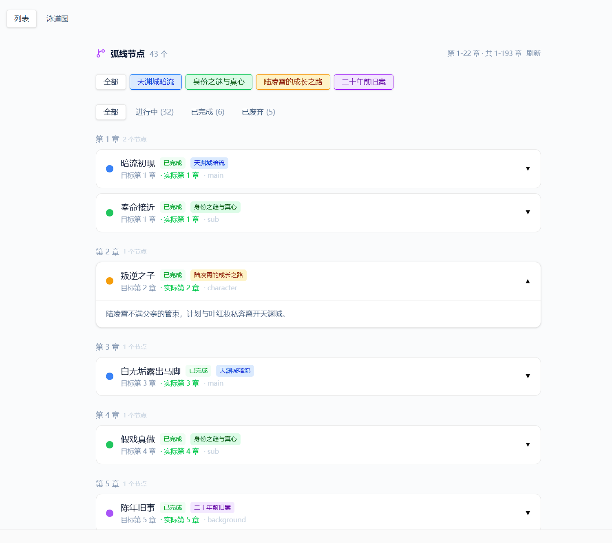
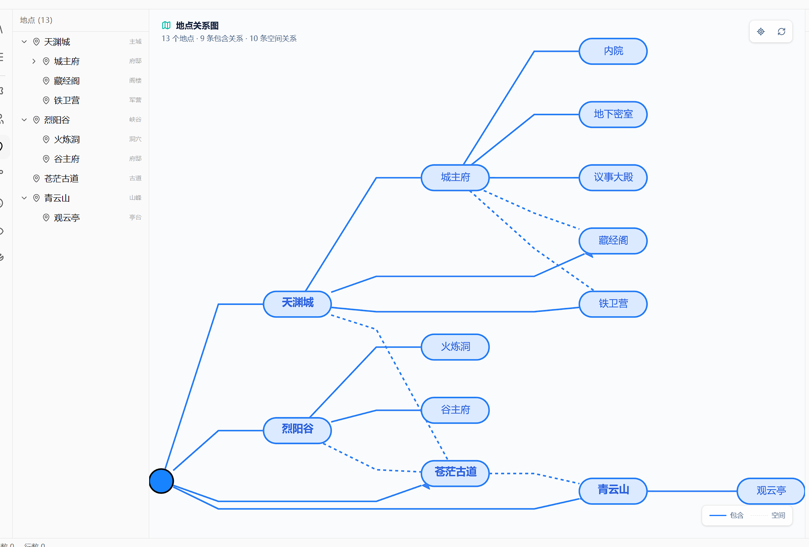
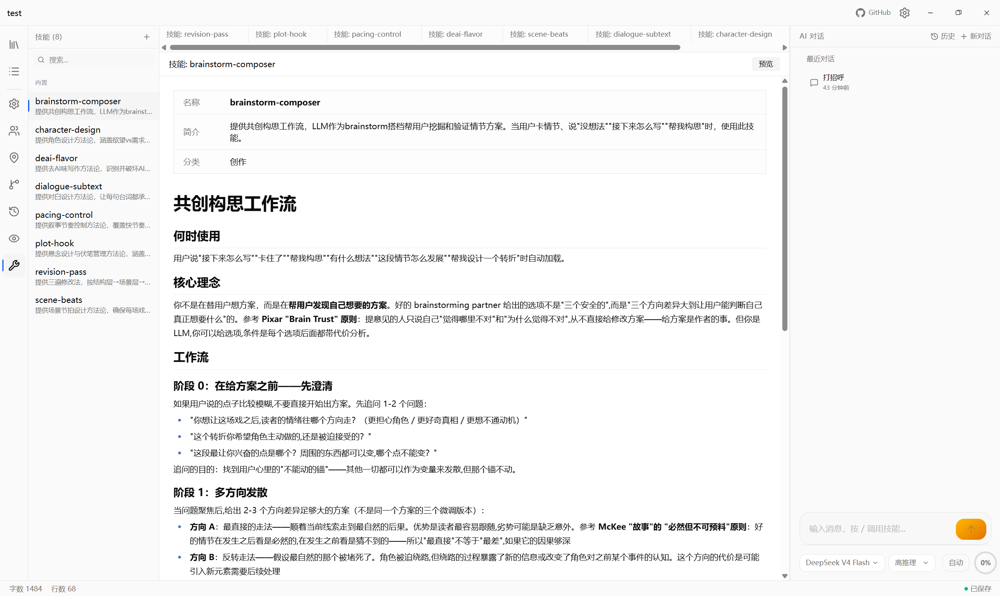

**中文** | [English](README_EN.md)

<div align="center">


</div>

<p align="center">
  
  
</p>

<h1 align="center">Novelist</h1>
<p align="center">
  本地优先的 AI 长篇写作工作台：管理角色状态、参考资料、写作方法和版本历史，在生成前补足叙述视角。
</p>

<p align="center">
  
  
  
  
  <br />
  
  
  
  
</p>

---

Novelist 面向长篇小说创作。小说需要情绪共鸣，但当前 AI 对情绪推进、表达分寸和角色内在反应的控制并不稳定。直接生成时，它常常跳出角色内部视角，改成说明剧情；人物的情绪、误解、盲区和身体反应如果没有提前组织，模型很容易写出解释句、剧本式动作和括号补充。

Novelist 把角色状态、参考语料、Skill、RAG 和 Git 放在同一个本地优先的工作台里。生成前先整理叙事视角和约束；生成后通过覆盖度信号、Diff 和保存边界交给作者确认。

它不把 AI 当成独立作者。故事方向、人物关系、主题取舍和关键情节仍由作者设定；AI 主要负责扩写、续写、改写和语料驱动的细化扩写，把作者给出的核心意图和参考语料转成可确认的候选文本。

## 设计思路

<table>
  <thead>
    <tr>
      <th width="22%">问题</th>
      <th width="78%">处理方式</th>
    </tr>
  </thead>
  <tbody>
    <tr>
      <td><strong>作者先定核心</strong></td>
      <td>故事方向、人物关系、主题取舍和关键情节先由作者确定。AI 在这些边界内做扩写、续写、改写和语料驱动的细化扩写。</td>
    </tr>
    <tr>
      <td><strong>情绪控制不足</strong></td>
      <td>小说靠情绪共鸣成立。AI 可以描述情绪，但很难稳定控制情绪从哪里来、推进到哪里、该露出多少。Novelist 将情绪状态放到生成前处理。</td>
    </tr>
    <tr>
      <td><strong>叙事意识缺位</strong></td>
      <td>句子好看还不够。AI 常把场景写成说明或剧本，缺少一个带着情绪、偏见和认知边界的叙述者。</td>
    </tr>
    <tr>
      <td><strong>风格成分有限</strong></td>
      <td>短句、口语化、白描等标签可以减少错误，但不能单独生成“人味”。叙述者的偏见、盲区、身体感和思绪游移，需要作为整体状态参与生成。</td>
    </tr>
    <tr>
      <td><strong>外部推演层</strong></td>
      <td>在只能使用 API 的约束下，Novelist 将情感认知和叙述视角放到模型外部。每次生成前，Tool 先推演角色此刻的情绪、表现方式、认知边界和可见信息，再注入 Prompt。</td>
    </tr>
  </tbody>
</table>

## 核心能力

<table>
  <thead>
    <tr>
      <th width="22%">能力</th>
      <th width="78%">说明</th>
    </tr>
  </thead>
  <tbody>
    <tr>
      <td><strong>叙事视角推演</strong></td>
      <td>生成前整理角色当前的情绪、偏见、盲区、可见信息和叙述位置。</td>
    </tr>
    <tr>
      <td><strong>结构化创作状态</strong></td>
      <td>角色关系、伏笔、弧线、地点、读者知道多少、作者偏好和章节计划，都放在可查询的状态里。</td>
    </tr>
    <tr>
      <td><strong>Agent 工具调用</strong></td>
      <td>AI 可以查前文、更新项目状态、维护偏好、提出候选内容，但不能偷偷把正文写进去。</td>
    </tr>
    <tr>
      <td><strong>Skill 方法论</strong></td>
      <td>用 Markdown Skill 留住具体做法，比如场景节拍、对白潜台词、节奏、修订和去 AI 味。</td>
    </tr>
    <tr>
      <td><strong>语料区与章节语料注入</strong></td>
      <td><code>素材库</code>以总览/制作/浏览/语料包四视图负责导入、后台分析、复核、检索和语料包携带共享参考语料；带章号的聊天回合自动注入 top-5 语料并显示覆盖度与用量，正文写入仍需作者确认。</td>
    </tr>
    <tr>
      <td><strong>本地搜索与历史</strong></td>
      <td>SQLite/sqlite-vec 保存 RAG 状态。正文写入走审批边界，项目变更保留 Git 历史。</td>
    </tr>
  </tbody>
</table>

## Phase 15 功能

Phase 15 已把旧 `goink-master` 的产品能力移植到现有 `.NET 10 + Photino.NET + React/Vite` 架构并交付；`goink-master` 只作为只读行为参考，不再作为实现目录或构建路径使用。其中风格素材库与叙事模式抽取已按 2026-08-31 轻量化聚焦方案退役并入语料通道，见[语料驱动写作](#语料驱动写作)。

- **小说导入**：书架支持通过桌面文件选择或拖放导入 `.epub`、`.txt`、`.md`、`.markdown`。TXT/Markdown 会做 UTF-8、UTF-16 LE/BE、GB18030 等编码识别；导入过程有进度、取消、跳过章节诊断、Git 提交、失败清理和启动恢复。默认大小限制为 TXT/Markdown 50 MB、压缩 EPUB 100 MB、EPUB 解压后累计 250 MB。
- **风格素材库**（2026-08-31 起并入语料通道）：原可保存全局或单本小说的风格样本，按标签/范围/关键词检索并生成 Skill 草稿；轻量化聚焦后退役，风格样例作为语料的一种导入来源走同一管线。
- **叙事模式抽取**（2026-08-31 起退役）：原可从章节范围抽取边界、摘要、阶段并生成可复用叙事 Skill 草稿；抽取类功能被结构化语料取代。
- **Git 历史面板**：使用内置 LibGit2Sharp/libgit2 读取本地版本历史，不依赖系统 Git CLI。界面支持分页提交、文件列表、重命名/删除/二进制标记和懒加载只读 diff，大文本 diff 会截断。
- **更新检查与 Git 作者**：设置中可配置更新检查 endpoint、手动检查和忽略版本；启动自动检查默认关闭且不阻塞写作。Git 提交作者可配置，留空时使用安全默认身份，并在导入提交和普通保存提交前写入 repo-local Git config。

## 语料驱动写作

当前主线以[轻量化聚焦方案](docs/corpus-driven-writing/lightweight-refocus-proposal-2026-08-31.md)为准：作者把控宏观、AI 细化扩写。2026-08-31 起，旧拼装线（蓝图迭代、保真拼装、编排运行、插入审计、license/相似度闸门）已整体退役，数据留档；风格素材库与叙事模式抽取并入语料通道，不再作为独立入口。

语料区（素材库）由四个轻视图组成：

- **总览**：资产卡片（参考书 / 特征观察 / 技法标本 / 语料条目）与覆盖度地图；
- **制作**：拖入参考书 → 后台分析 → 复核卡片流（原文 + 维度判断，单键确认/驳回）；
- **浏览**：按书、按维度筛选观察与标本，evidence 原文对照；
- **语料包**：按参考书导出/导入 JSONL，导入按同书恢复语义合并、已存在条目自动跳过。

对话写作闭环是唯一主闭环：

```text
人提出想法点
  -> AI 访谈（选择题逐项追问，选项尽量引用语料实例）
  -> 收口后问"是否开写"
  -> 作者确认 -> 开写：
      语料覆盖充分 -> 按章节自动检索注入 top-5 语料，细化 + 扩写
      语料不足（覆盖率 <50%）-> 明确提示"语料不足"，可直写或先补参考书
  -> 作者做选择题（beat 选项 / 正文候选 / 处理方式）
  -> 往复，直到本章完成
```

- 带章号的聊天回合自动执行语料注入（与写作同一条检索通路），以系统消息注入 top-5 语料，并通过工具事件与 `corpus_usage` 双通道展示用量（出处书名、标签、预览）；
- 覆盖度 = 细纲 beat 的检索命中占比：<50% 判「语料不足」，50%–90% 正常注入并提示缺语料的 beat，作者始终可以选择直写（诚实标注），不阻塞写作；
- 正文写入必须作者确认：聊天与语料流程不自动调用 `SaveContent`，AI 可以提出候选和修订，最终正文仍走作者确认后的编辑/保存路径。

旧参考锚定的来源、事实边界、POV、蓝图与材料绑定护栏已随拼装线退役；SafePath、审批、git/diff 审计与迁移 copy-first 等质量边界保持不变（见「质量边界」）。

## Skill 自定义

Skill 用来沉淀可复用的写作方法，不直接替代叙事状态。每个 Skill 是带 YAML frontmatter 的 Markdown 文件，支持三层覆盖和三种触发模式：

<table>
  <thead>
    <tr>
      <th width="20%">机制</th>
      <th width="80%">说明</th>
    </tr>
  </thead>
  <tbody>
    <tr>
      <td><strong>覆盖顺序</strong></td>
      <td>小说级 <code>skills/&lt;name&gt;.md</code><br />用户级 <code>~/.novelist/skills/&lt;name&gt;.md</code><br />内置只读 <code>/builtin/skills/&lt;name&gt;.md</code></td>
    </tr>
    <tr>
      <td><strong>触发模式</strong></td>
      <td><code>auto</code> 可由 AI 或用户 <code>/</code> 调用；<code>manual</code> 只支持用户触发；<code>always</code> 会在会话开头注入。</td>
    </tr>
    <tr>
      <td><strong>状态文件</strong></td>
      <td><code>novelist.md</code> 保存故事状态，供 Agent 恢复上下文并维护长期连续性。</td>
    </tr>
  </tbody>
</table>

最小 Skill 文件：

```markdown
---
name: 节奏控制
description: 控制场景推进、停顿和悬念释放
category: 写作方法
mode: auto
---

# 使用方法

根据当前章节目标调整叙事节奏。
```

## 当前状态

<table>
  <thead>
    <tr>
      <th width="22%">范围</th>
      <th width="78%">状态</th>
    </tr>
  </thead>
  <tbody>
    <tr>
      <td><strong>桌面主线</strong></td>
      <td>已迁移到 <code>.NET 10 + Photino.NET + React/Vite</code>。</td>
    </tr>
    <tr>
      <td><strong>参考锚定</strong></td>
      <td>拼装线已退役（2026-08-31 轻量化聚焦）：蓝图迭代、保真拼装、编排运行与插入审计已物理删除，数据留档；章节写作改由对话闭环承接，真实用户无指导走查仍未完成。</td>
    </tr>
    <tr>
      <td><strong>语料驱动写作</strong></td>
      <td>M1 产品薄切片成立，M2 的 50K 全管线标准门已通过；M4/M5 拼装线与 M6 插入审计已退役；语料区四视图与对话写作闭环（访谈选择题、章节注入、覆盖度信号）已有浏览器工作流覆盖；真实目标用户无指导走查仍未完成。整体仍为 S，尚未达到生产闭环 P 或规模化 L。</td>
    </tr>
    <tr>
      <td><strong>Phase 15</strong></td>
      <td>已交付：小说导入、Git 历史 UI、更新检查与 Git 作者配置；风格素材库与叙事模式抽取已按轻量化聚焦退役并入语料通道。</td>
    </tr>
    <tr>
      <td><strong>前端构建</strong></td>
      <td>Vite 8/Rolldown 已拆分主入口、工作区、Monaco、Markdown、Mermaid 和图谱依赖。</td>
    </tr>
    <tr>
      <td><strong>来源致谢</strong></td>
      <td>Novelist 源于 <a href="https://github.com/sigpanic/goink">goink</a>，并在此基础上重构为当前桌面写作工作台。</td>
    </tr>
  </tbody>
</table>

## 最新更新

### 2026-09-03

- 轻量化聚焦方案（2026-08-31 定稿）落地：活动栏收敛为书架/素材库/设置三主区加本书工具；语料区重建为总览/制作/浏览/语料包四视图；拼装线（蓝图迭代、保真拼装、编排运行、插入审计、license/相似度闸门）整体退役，数据留档。
- 对话写作闭环首版：带章号的聊天回合自动检索注入 top-5 语料并展示用量卡片；新增章节覆盖度信号（<50% 提示「语料不足」，可直写或补书）；AI 访谈以选择题推进，作者确认后开写。
- 完成 2026-09-02/03 用户视角评审（round 3/4）修复：迁移 UI 与进度事件、章节删除安全、toast 可访问性、busy 锁、审批卡死升级等。

### 2026-07-12

- `素材库`添加参考书现在会快速登记来源，随后由章节确认和 5/10 章批次材料化完成后续处理；不会再在添加时同步跑完整旧语料流程。
- 参考书删除、自动章节分析和 AI 蓝图预演不再受固定 30 秒桌面请求时限影响。
- `素材库`现在会以固定采样和严格结构化结果调用已配置的大模型；带思考输出的 DeepSeek 模型可正常完成健康检查与材料判断。
- 不合规的模型结果会直接显示失败，绝不会作为可用素材混入材料库或蓝图预演。
- 自动章节切分会等待严格模型结果，并能排除电子书目录中与正文重复的章节标题；UTF-8 BOM、全角/半角标题空白和长文本证据偏移不会再导致可识别的来源分析失败。运行测试不会影响已配置的本地模型和素材库数据目录。
- 可与前后文衔接的低信息短段会先合并为语义窗口；独立短句仍由模型决定保留或拒绝。
- 由多个连续句节点完整覆盖的超长自然段会被拆为不重叠、可追溯的窗口，不会截断来源正文。
- 无法安全拆分的超长来源会显示材料化失败，不会截断、跳过或激活部分结果。

完整变更见 [Release Notes](docs/releases/release-notes.md)。

## 截图

<p align="center">
  
</p>
<p align="center">
  
  
</p>
<p align="center">
  
  
</p>

## 项目结构

```text
src/
  Novelist.App             Photino 桌面宿主和本地前端资源解析
  Novelist.Contracts       桥接 DTO 和跨层契约
  Novelist.Core            应用接口、桥接分发和核心边界
  Novelist.Infrastructure  文件系统、SQLite、RAG、语料处理与材料化实现
  Novelist.Agent           Microsoft Agent Framework 工具适配

frontend/
  src/lib/novelist         自有 Photino bridge adapter
  src/components           React UI 组件
  scripts                  Playwright mock-bridge 工作流

tests/
  Novelist.Tests
  Novelist.IntegrationTests
```

## 安装

当前构建版本先只考虑 Windows。可从 [Releases](https://github.com/devhxj/novelist/releases) 下载 Windows 安装包并运行安装程序。

需要配置 LLM API Key。内置 DeepSeek、GLM、MiMo 模板，并兼容 OpenAI 格式接口。Windows 安装包自带桌面宿主、前端资源和 LibGit2Sharp 原生运行时，不需要 Python、Node.js、外部数据库或单独安装 Git CLI。本地版本历史由内置 libgit2 运行时提供。

语义检索可使用在线 Embeddings API，也可切换到内置 ONNX。ONNX 模式固定使用随包的 `bge-small-zh-v1.5` int8 模型，不会静默回退到线上 API。

Windows SmartScreen 可能提示未签名程序，可通过“更多信息”继续运行。

## 从源码构建

依赖：

- Windows 10/11
- .NET 10 SDK
- Node.js/npm
- Git Bash / Git（用于克隆源码和运行发布脚本；本地版本历史不依赖系统 Git）
- Inno Setup 6（仅打 Windows 安装包时需要）

```bash
git clone https://github.com/devhxj/novelist
cd novelist
dotnet restore Novelist.slnx
npm --prefix frontend ci
npm --prefix frontend run build
bash scripts/novelist-publish.sh win-x64
```

启动桌面开发模式：

```bash
npm --prefix frontend run build
dotnet run --project src/Novelist.App/Novelist.App.csproj -- --desktop
```

只调试前端：

```bash
npm --prefix frontend run dev
```

只启动 Vite 时，桌面桥接 API 不可用。如需桥接能力，让 Photino 宿主用 `--start-url=http://localhost:5173/` 加载 Vite 页面。

## 常用命令

<table>
  <thead>
    <tr>
      <th width="38%">命令</th>
      <th width="62%">用途</th>
    </tr>
  </thead>
  <tbody>
    <tr>
      <td><code>dotnet&nbsp;run&nbsp;--project&nbsp;src/Novelist.App/Novelist.App.csproj&nbsp;--&nbsp;--desktop</code></td>
      <td>启动 Photino/.NET 桌面应用。</td>
    </tr>
    <tr>
      <td><code>bash&nbsp;scripts/novelist-publish.sh&nbsp;win-x64</code></td>
      <td>发布指定 RID 的自包含产物。</td>
    </tr>
    <tr>
      <td><code>VERSION=1.2.3&nbsp;bash&nbsp;scripts/novelist-package-windows.sh</code></td>
      <td>生成 Windows 安装包。</td>
    </tr>
    <tr>
      <td><code>npm&nbsp;--prefix&nbsp;frontend&nbsp;run&nbsp;dev</code></td>
      <td>启动 Vite 前端开发服务器。</td>
    </tr>
    <tr>
      <td><code>npm&nbsp;--prefix&nbsp;frontend&nbsp;run&nbsp;build</code></td>
      <td>TypeScript 构建和 Vite 生产构建。</td>
    </tr>
    <tr>
      <td><code>npm&nbsp;--prefix&nbsp;frontend&nbsp;run&nbsp;lint</code></td>
      <td>前端 ESLint。</td>
    </tr>
    <tr>
      <td><code>npm&nbsp;--prefix&nbsp;frontend&nbsp;run&nbsp;verify</code></td>
      <td>执行前端 build、lint、node 单测、语料区/章节浏览器工作流和基础 app-wide 烟测。</td>
    </tr>
    <tr>
      <td><code>npm&nbsp;--prefix&nbsp;frontend&nbsp;run&nbsp;test:phase16</code></td>
      <td>运行语料区四视图和章节对话写作（含拼装线退役断言）的浏览器工作流。</td>
    </tr>
    <tr>
      <td><code>npm&nbsp;--prefix&nbsp;frontend&nbsp;run&nbsp;test:reference-workspace</code></td>
      <td>运行语料区（总览/制作/浏览/语料包）四视图的聚焦浏览器工作流。</td>
    </tr>
    <tr>
      <td><code>dotnet&nbsp;test&nbsp;Novelist.slnx&nbsp;--no-restore&nbsp;-v&nbsp;minimal</code></td>
      <td>运行 .NET 测试套件。</td>
    </tr>
  </tbody>
</table>

## 质量边界

开发或审查相关代码时，请保留这些边界：

- 正文写入必须经过作者确认，不允许语料/聊天流程直接保存正文；
- 文件访问保持 SafePath 和沙箱检查；
- Web/外部资源工具保持 SSRF 防护；
- 用户数据迁移必须 copy-first，源数据保持不变并写入 manifest；
- API Key、本地模型路径和用户数据不进入 git；
- 运行时 Git 与本地 ONNX 模型放在 `build/runtime/` 或 app data/config 路径；ONNX Runtime 与 sqlite-vec 通过 NuGet 发布资产进入产物，额外覆盖库也不要放源码目录。

## 文档入口

- [Reference Anchor Technical Baseline](docs/reference-anchor-layer-plan.md)
- [Reference Anchor Implementation Plan](docs/reference-anchor-implementation-plan.md)
- [Corpus-Driven Writing 开发计划](docs/corpus-driven-writing/development-plan.md)
- [Corpus-Driven Writing 任务与当前状态](docs/corpus-driven-writing/tasks.md)
- [Corpus-Driven Writing 进展审计（2026-07-10）](docs/corpus-driven-writing/progress-audit-2026-07-10.md)
- [轻量化聚焦方案（2026-08-31）](docs/corpus-driven-writing/lightweight-refocus-proposal-2026-08-31.md)
- [用户视角评审与改进计划（2026-09-02，round 4）](docs/corpus-driven-writing/user-perspective-review-2026-09-02-round4.md)
- [Photino Bridge Contract](docs/novelist-photino-bridge-contract.md)
- [Release Notes](docs/releases/release-notes.md)

## 许可与来源

Novelist 以 MIT License 发布，详见 [LICENSE](LICENSE)。项目最初 fork 自 MIT 版本 [goink](https://github.com/sigpanic/goink)，当前主体已重做为 `.NET 10 + Photino.NET + React/Vite` 的 Novelist。来源与兼容边界见 [NOTICE](NOTICE)。

本仓库不合并上游改为 AGPL 后的新代码；若继续使用或分发本仓库，请保留 MIT 版权和许可声明。
