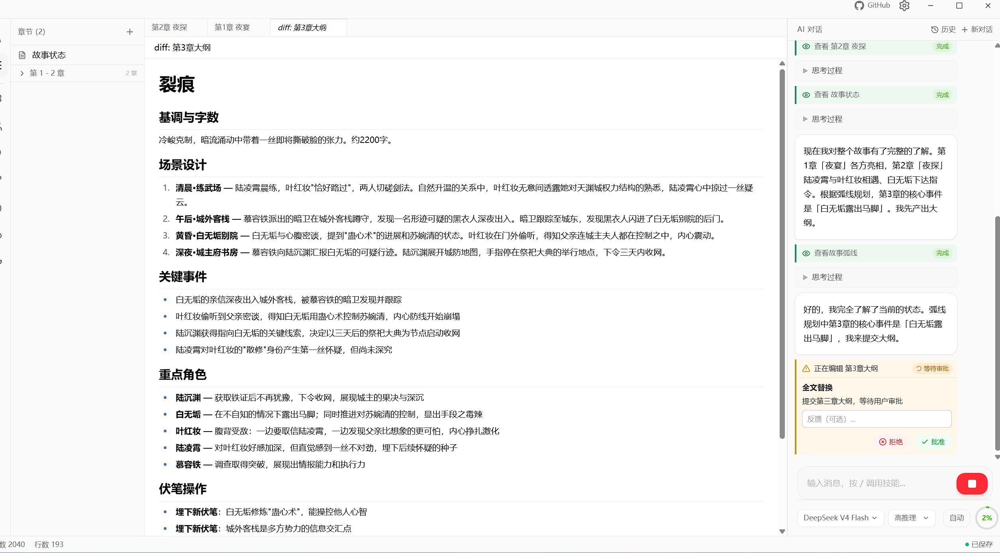

<p align="center">
  
  
</p>

<h1 align="center">Desktop AI Novel-Writing System<br><sub>Agent Real-Time Decisions × Structured Memory × Post-Writing Self-Check</sub></h1>

<p align="center">
  
  
  
  
  <br />
  
  
  
  
</p>

---

<p align="center"><strong>Anyone who has tried to write a novel with a general-purpose AI knows the pain—by chapter five it forgets the protagonist's name. By chapter thirty you're manually flipping through earlier chapters hunting for that one foreshadowing line. After finishing a chapter you have to remind it yourself to "update character status" and "check arc progress." Goink doesn't have these problems. It's a desktop AI writing system with structured memory—character profiles, foreshadowing states, arc progress, location relationships, reader knowledge—the system remembers, and the Agent looks it up, edits it, and maintains it on its own.</strong></p>

## What Makes It Different From General AI Chat

| | General AI Chat | Goink |
|---|---|---|
| Creative context | Re-explain everything in every conversation | Full structured tracking: characters, relationships, foreshadowing, arcs, locations, reader knowledge |
| Editing | Outputs text directly; no idea what changed | Diff preview + line-by-line comparison + approve before writing |
| Finding past content | Manual searching, flipping through chapters | Local semantic search—"that pendant" finds every relevant passage |
| Post-writing maintenance | Doesn't care unless you remind it | Auto-triggers character updates, foreshadowing resolution, arc progression, reader knowledge refresh after writing |
| Writing style | Prompt-based brute force | 8 built-in methodologies + custom Skill hot-reload, three-layer override |
| Version history | None | Built-in Git, auto-commit every conversation, rollback anytime |
| Dependencies | Often needs Python/GPU | Single installer, ready to go |

## The AI Looks It Up, Edits It, and Maintains It—Not a Pipeline, an Agent

31 structured tools. The LLM autonomously decides which to call, what parameters to pass, and what to do next. Not a "finish a chapter, hand off to the next stage" pipeline—the Agent calls tools within the current conversation to check characters, check foreshadowing, read and write content, and update state, all the way to completion.

After a chapter is written, the system automatically injects maintenance reminders telling the Agent exactly what to check: have characters changed, has pending foreshadowing been resolved, do arc nodes need to advance, does reader knowledge need updating. The Agent won't "forget maintenance"—it's forced to self-check item by item.

If that's still not enough, you can launch the Review Sub-Agent—an independent Agent that audits the chapter content against system state from scratch, flags any inconsistencies straight into the conversation, and lets the main Agent fix them on the spot.

## Finding One Sentence Across Hundreds Of Thousands Of Words: Local Semantic Search

On chapter fifty, wondering "where exactly did the protagonist first see that pendant?"—no need to flip through every chapter. Tell the AI a sentence, and it finds the relevant passages across the entire book.

Not keyword matching—meaning-based search. Ask "clues about the pendant" and it finds paragraphs that never mention the word "pendant" but clearly allude to it. The Agent can also proactively search earlier content when writing new chapters to maintain consistency.

The entire engine runs locally—BGE Chinese semantic model via ONNX local inference, sqlite-vec vector index, MMR de-duplication re-ranking. Background incremental indexing after each chapter. No network, no extra configuration.

## Not Just Memory—Structured Creative State

### Characters: Relationships Have History

Character profiles include personality, abilities, and background. Character relationships form a directed graph—"Zhang San towards Li Si: mentor but secretly wary," "Li Si towards Zhang San: respectful but withholding"—two independent records. Old relationship records are preserved when things change, so you can review the evolution.

### Foreshadowing: No More Loose Threads

Every foreshadowing entry records a target resolution chapter and importance level. System alerts near resolution points; overdue unresolved items are flagged as anomalies. Chapter plans have three tiers—next chapter, near-term, far-term—to manage creative pacing.

### Arcs: Cross-Chapter Narrative Threads

Arcs consist of node chains, each node associated with a target chapter. Nodes auto-advance when a chapter is completed. A story typically tracks 3–5 parallel arcs simultaneously.

### Worldbuilding: Locations Are a Graph, Not a List

Track hierarchy (Kingdom → Palace → Great Hall) and spatial connections (A and B connected by a mountain path). The AI can query details, sub-locations, connections, or the full map.

### Reader Knowledge: Control Information Release

Track what the reader knows, what answers they're waiting for, and what they've misunderstood. Precisely control suspense timing and reveal moments.

### Writing Preferences: Say It Once

Two-tier management: global preferences and per-novel preferences. By chapter thirty-seven, "keep dialogue cold and restrained" still takes effect.

## Frontend Visualized State
<p align="center">
  
  
  
</p>

## Skill Matrix: Any Writing Style, Drop a File and It Works

8 built-in creative methodologies—Scene Beats, Dialogue Subtext, Pacing Control, Suspense Hooks, Character Design, Revision Polish, De-AI-ify, Co-Creation Brainstorm—covering the full writing workflow. Load with `/skillname` and the LLM executes the methodology workflow.

Need more? Create a `.md` file and it becomes a new Skill:

```markdown
---
name: My Writing Process
description: Custom personal creative workflow
category: Custom
---
# Content...
```

Three-layer override (Built-in → User → Novel), **same-name Skills override by level**, hot-reload, zero-code extensibility.

<p align="center">
  
</p>

## Triple Assurance: Maintenance Never Gets Missed

**Layer 1—System Prompt** • Agent's core instructions hard-code the maintenance workflow. "Perform state maintenance immediately after creative completion. This is not optional."

**Layer 2—Dynamic Injection** • After the AI writes a long piece, the system auto-injects check items—character changes, foreshadowing status, arc nodes, reader knowledge.

**Layer 3—Review Sub-Agent** • An independent sub-agent compares the chapter against system state and reports any issues immediately.

## Your Approval, Every Time

The AI doesn't modify the manuscript directly. Every edit generates a Diff first, then waits for your approval before writing. Approve, reject, or give feedback for the AI to revise on the spot. You can also switch to auto mode for continuous multi-round free-writing.

Every change has Git history. Roll back to any state at any time.
<p align="center">
  
  
</p>
## The AI Can't Touch Files It Shouldn't

Dual-layer sandbox security isolation—regex whitelist only allows legitimate paths like `chapters/`, `outlines/`, `goink.md`; SafePath prevents path traversal. Files are re-read and compared before writing to prevent overwriting your manual edits.

## Installation

Download the installer for your platform from [Releases](https://github.com/sigpanic/goink/releases):

- **Windows** — Run the installer
- **macOS** — Open DMG, drag to Applications
- **Linux** — Run the AppImage

Requires an LLM API Key (built-in DeepSeek, GLM, MiMo templates; compatible with OpenAI format). Installer < 60MB. No Python, Node.js, database, or GPU required. Windows SmartScreen may show a warning (unsigned)—click "More info" → "Run anyway."

### Build From Source

```bash
sudo apt install libsqlite3-dev libgtk-3-dev libwebkit2gtk-4.1-dev gcc
git clone https://github.com/sigpanic/goink
cd goink
make deps
make build   # production build
make dev     # dev mode (hot reload)
```

## Tech Stack

| Layer | Technology |
|---|---|
| Agent Engine | Custom ReAct loop (Go, SSE streaming + 31 Function Calling tools + nested sub-agents) |
| Desktop Framework | Wails v2 (Go + WebView) |
| Editor | Monaco Editor |
| Database | SQLite + GORM (ACID transactions + operation log rollback) |
| Vector Search | sqlite-vec + ONNX Runtime (bge-small-zh-v1.5 int8 quantized) |
| Version Control | Built-in Git (auto commit / Diff / Revert) |
| Security | Regex whitelist + SafePath dual sandbox + approval flow |
| Frontend | React 19 + TypeScript + Tailwind CSS 4 + shadcn/ui |

## License

MIT
